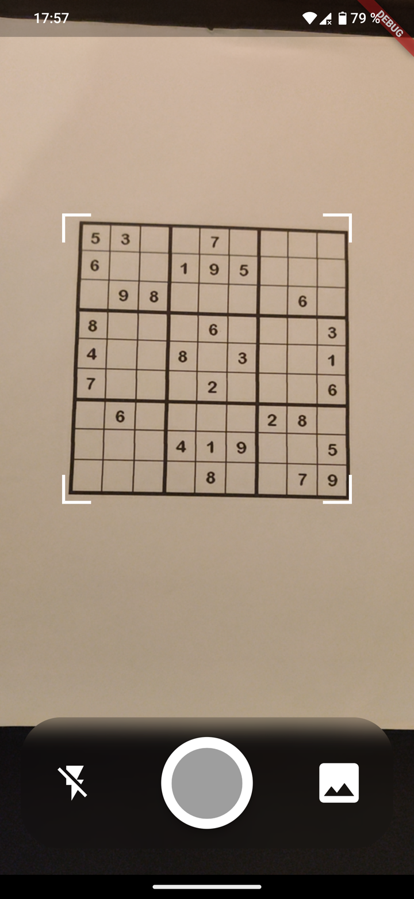
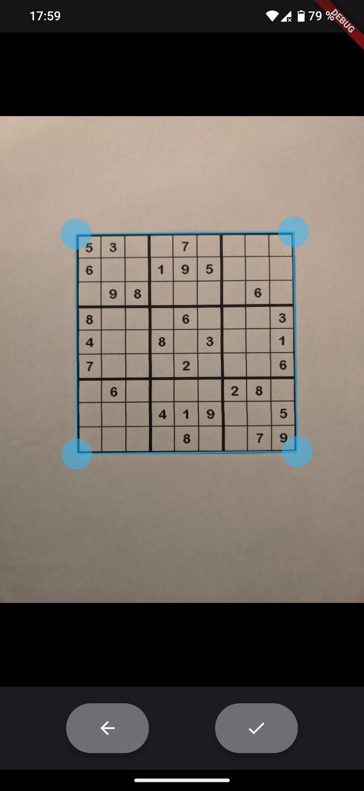
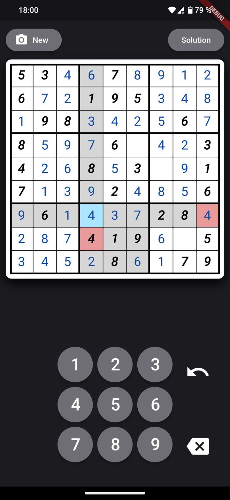
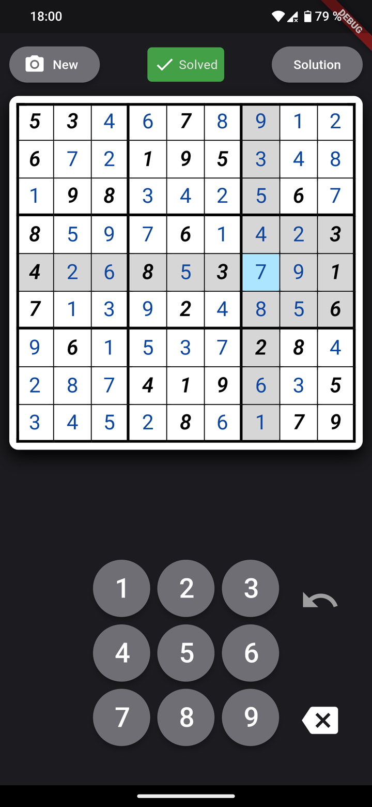

#  SudokuAI

Take Sudoku puzzles out of their printed medium and solve them on your smartphone instead!

Using Computer Vision and AI this app can detect and extract Sudoku grids from images and display them as digital puzzles on the users phone.

<p align="middle">

&nbsp;

&nbsp;

&nbsp;

</p>

## How to build

You need to have [Flutter](https://docs.flutter.dev/get-started/install/linux/android) and [Android SDK](https://docs.flutter.dev/get-started/install/linux/android#configure-android-development) installed.

First you need to setup third-party JNI libraries and update the sudoku_scanner plugin:
``` sh
cd sudoku_scanner
sh setup.sh
flutter pub get
cd ..
```

Then update the main app and run the build command:
``` sh
flutter pub get
flutter run
```
You can run `flutter build apk` to just build the apk without running it.

> \[!NOTE]\
> Read [here](sudoku_scanner/) for more information on how to debug and test the sudoku_scanner plugin!
